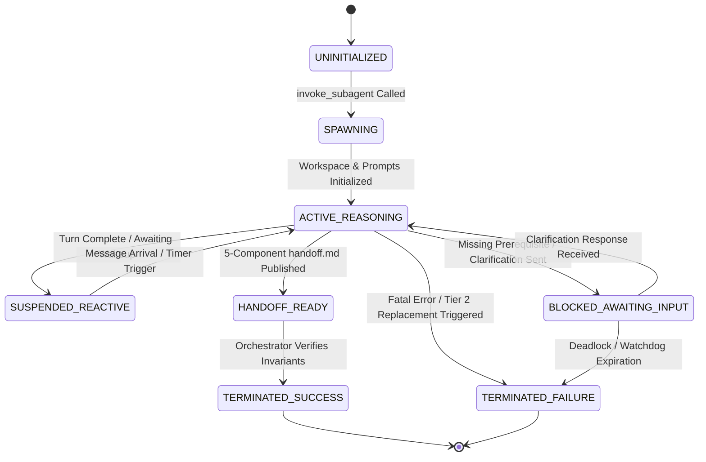

# Subagent Lifecycle Management & Supervision

The **Subagent Lifecycle Management Protocol** defines the operational stages, lifecycle state machines, context sandboxing rules, heartbeat monitoring mechanisms, and replacement/succession procedures for subagents executing within the Antigravity Multi-Agent Reasoning Framework.

---

## 1. Lifecycle State Model

Every subagent traverses eight deterministic states during its operational lifetime:

```
┌─────────────────────────────────────────────────────────────────────────────┐
│                           Subagent Lifecycle States                         │
├───────────────────────┬─────────────────────────────┬───────────────────────┤
│ UNINITIALIZED         │ SPAWNING                    │ ACTIVE_REASONING      │
│ (Declared in registry)│ (Invoking runtime instance) │ (Executing tool steps)│
├───────────────────────┼─────────────────────────────┼───────────────────────┤
│ SUSPENDED_REACTIVE    │ BLOCKED_AWAITING_INPUT      │ HANDOFF_READY         │
│ (Awaiting async event)│ (Waiting on dependency)     │ (Handoff.md published)│
├───────────────────────┴─────────────────────────────┴───────────────────────┤
│ TERMINATED_SUCCESS / TERMINATED_FAILURE                                     │
│ (Clean teardown or error escalation)                                        │
└─────────────────────────────────────────────────────────────────────────────┘
```

### Mermaid Lifecycle State Machine


---

## 2. State Transition Table

| Current State | Trigger / Event | Guard / Condition | Next State | Actions & System Operations |
|---|---|---|---|---|
| `UNINITIALIZED` | Task scheduled in DAG | Definition exists in [Subagent Registry](../resources/subagents.json) | `SPAWNING` | Create directory `.agents/<agent_name>/`; load system prompt |
| `SPAWNING` | Subagent initialized | Context sandbox prepared | `ACTIVE_REASONING` | Write initial `DISPATCH.md` and `BRIEFING.md`; send task dispatch |
| `ACTIVE_REASONING` | Tool step executed | Subtask in progress | `ACTIVE_REASONING` | Update `progress.md` heartbeat with current UTC timestamp |
| `ACTIVE_REASONING` | Turn concludes | Awaiting subagent/task response | `SUSPENDED_REACTIVE` | End turn; enter zero-polling reactive sleep |
| `SUSPENDED_REACTIVE` | Event arrives | Message or scheduled watchdog triggers | `ACTIVE_REASONING` | Resume execution with event context in prompt |
| `ACTIVE_REASONING` | Missing dependency | Unresolved blocker or ambiguous spec | `BLOCKED_AWAITING_INPUT` | Transmit `clarification_request` envelope to supervisor |
| `BLOCKED_AWAITING_INPUT` | Response delivered | Supervisor sends resolution brief | `ACTIVE_REASONING` | Ingest input and resume reasoning |
| `ACTIVE_REASONING` | Work completed | Invariants met, handoff written | `HANDOFF_READY` | Transmit `handoff_report` envelope with artifact path |
| `HANDOFF_READY` | Verification green | Invariants 100% satisfied | `TERMINATED_SUCCESS` | Clean up background tasks; record resolved status in DAG |
| `ACTIVE_REASONING` | Context saturation / Loop | Hallucination or fatal exception | `TERMINATED_FAILURE` | Trigger Tier 2 succession; archive corrupted state |

---

## 3. Spawning & Initialization Protocol

Subagents are defined declaratively in [resources/subagents.json](../resources/subagents.json) and instantiated using `invoke_subagent`.

### 3.1 Workspace Directory Structure
Every subagent is allocated a dedicated, sandboxed workspace directory inside `.agents/`:

```
.agents/<agent_name>/
├── DISPATCH.md        # Verbatim task instructions received from Orchestrator
├── BRIEFING.md        # Persistent working memory (Identity, Constraints, Decisions)
├── progress.md        # Liveness heartbeat and milestone checklist
├── context.md         # Domain-specific extracted code snippets / context
├── handoff.md         # Final 5-component handoff deliverable
└── [artifacts]        # Intermediate plans, diffs, critiques, or logs
```

> **Critical Invariant**: `.agents/` contains ONLY agent metadata and intermediate findings. Source code, production tests, and user assets must NEVER be placed in `.agents/`.

---

## 4. Heartbeat & Liveness Supervision

To ensure execution vitality and detect hung processes early:

1. **Heartbeat Timestamping**:
   - Every subagent updates `progress.md` after every meaningful tool step with an ISO-8601 UTC timestamp:
     ```markdown
     # Agent Progress Log
     Last visited: 2026-08-24T21:54:00Z
     ```
2. **Liveness Health Checks**:
   - Orchestrators monitor worker liveness. During long-running background tasks (e.g. large builds), agents must touch `progress.md` at least once every 5 minutes.
3. **Scheduled Watchdog Supervisions**:
   - For critical execution paths, the Orchestrator registers an asynchronous watchdog via `schedule(DurationSeconds=N, Prompt="...", TimerCondition="<worker_id>")`.
   - If the worker responds before the timer fires, the watchdog is cancelled automatically.

---

## 5. Succession Protocol & Context Freshness Reset (Tier 2 Escalation)

When a subagent enters an unrecoverable hallucination loop, suffers context window saturation, or repeatedly fails static invariants, the system engages the **Succession Protocol**:

```
[Corrupted Agent: worker_m1] ──► (Terminated & Archived to .agents/worker_m1/)
                                        │
                                        ▼ (Compile Sanitized State Snapshot)
[Successor Agent: worker_m1_2] ◄── (Spawned with Fresh Context Sandbox)
```

### 5.1 Step-by-Step Succession Procedure
1. **Teardown Current Instance**:
   - Terminate lingering background commands via `manage_task(Action='kill')`.
   - Mark `.agents/<agent_name>/` as archived.
2. **Compile Sanitized State Snapshot**:
   - The Orchestrator extracts a concise state summary containing:
     * Original task objective and functional invariants.
     * Verified subset of deliverables and accurate code citations.
     * Specific failure modes and anti-patterns to avoid.
3. **Spawn Successor Instance**:
   - Instantiate replacement agent in `.agents/<agent_name>_2/`.
   - Deliver the sanitized snapshot in the initial task brief.
   - Successor executes with a clean, unpolluted context window.

---

## 6. Clean Teardown & Termination Invariants

Upon task completion or failure escalation, the subagent and supervisor enforce four cleanup invariants:

1. **Background Process Cleanup**:
   - All background tasks spawned by the agent must be verified as finished or explicitly killed.
2. **Handoff Completeness**:
   - `handoff.md` must be fully populated with Observation, Logic Chain, Caveats, Conclusion, and Verification Method.
3. **Workspace Sanitation**:
   - No temporary scratch files or intermediate diffs left in the project root directory.
4. **DAG Resolution Notification**:
   - The supervisor updates the global DAG state and notifies dependent downstream workers.

---

## 7. Related Protocols & References

- **[Subagent Registry Catalog](../resources/subagents.json)**
- **[Inter-Agent Message Protocols](message_protocols.md)**
- **[Subagent Tool Matrix](tool_matrix.md)**
- **[Hierarchical Decomposition Workflow](../workflows/hierarchical.md)**
- **[Debate Protocol Workflow](../workflows/debate.md)**
- **[Map-Reduce Exploration Workflow](../workflows/map_reduce.md)**
- **[Iterative Refinement Loop Workflow](../workflows/iterative_loop.md)**
