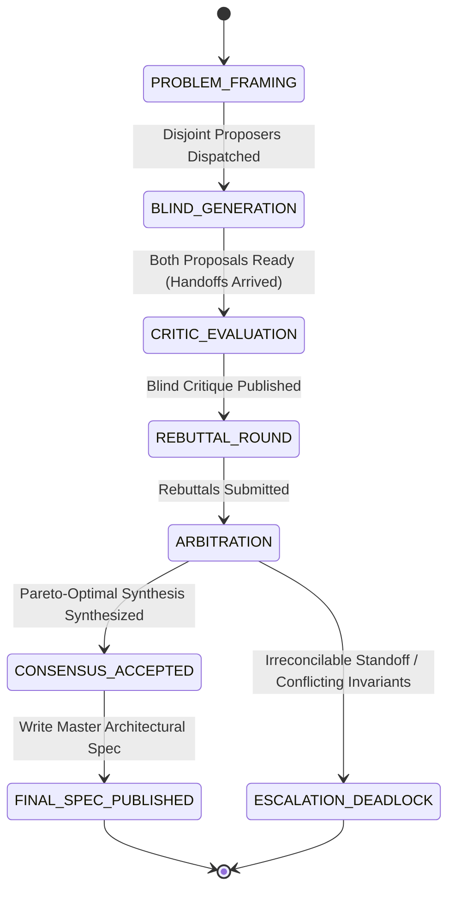

# Debate & Adversarial Peer Review Protocol

The **Debate & Adversarial Peer Review Protocol** is a specialized multi-agent reasoning topology designed for high-stakes architectural decisions, ambiguous root-cause diagnoses, security threat modeling, and trade-off optimizations (e.g., latency vs. memory, consistency vs. availability).

By pitting competing proposals against each other in **parallel isolation**, evaluating them through a **blind adversarial critic**, and conducting a structured **rebuttal round**, this protocol eliminates confirmation bias, exposes latent failure modes, and yields robust consensus solutions.

```
                      ┌────────────────────────────────────────┐
                      │          Moderator / Arbiter           │
                      │  - Frames Problem & Evaluation Matrix  │
                      └──────────────────┬─────────────────────┘
                                         │
                   ┌─────────────────────┴─────────────────────┐
                   │ (Blind Parallel Dispatch)                 │
                   ▼                                           ▼
          ┌─────────────────┐                         ┌─────────────────┐
          │ Proposer Alpha  │                         │  Proposer Beta  │
          │ (Architecture A)│                         │ (Architecture B)│
          │  .agents/prop_a │                         │  .agents/prop_b │
          └────────┬────────┘                         └────────┬────────┘
                   │                                           │
                   └─────────────────────┬─────────────────────┘
                                         │ (Anonymized Proposals)
                                         ▼
                      ┌────────────────────────────────────────┐
                      │           Adversarial Critic           │
                      │ - Multi-Criteria Scoring & Flaw Probing│
                      │ - STRIDE Threat Modeling & Edge Cases  │
                      └──────────────────┬─────────────────────┘
                                         │
                   ┌─────────────────────┴─────────────────────┐
                   │ (Distribute Critique & Counter-Proposals) │
                   ▼                                           ▼
          ┌─────────────────┐                         ┌─────────────────┐
          │ Rebuttal Alpha  │                         │  Rebuttal Beta  │
          │(Concede & Patch)│                         │(Concede & Patch)│
          └────────┬────────┘                         └────────┬────────┘
                   │                                           │
                   └─────────────────────┬─────────────────────┘
                                         │
                                         ▼
                      ┌────────────────────────────────────────┐
                      │          Moderator / Arbiter           │
                      │  - Synthesizes Pareto-Optimal Spec     │
                      │  - Integrates Mandated Guardrails      │
                      └────────────────────────────────────────┘
```

---

## 1. Subagent Roles & Responsibilities

The debate topology assigns specialized subagent roles in accordance with the [Subagent Registry](../resources/subagents.json) and [Tool Matrix](../references/tool_matrix.md):

| Role Archetype | Primary Responsibilities in Topology | System Prompt Reference | Permitted Capabilities |
|---|---|---|---|
| **Moderator / Arbiter** | Problem framing, evaluation rubric definition, rebuttal moderation, consensus synthesis | [Planner Prompt](../prompts/planner.md) | `enable_subagent_tools: true`, Read-only |
| **Proposer Alpha** | Generates primary candidate design (e.g. optimized for throughput/caching) in isolation | [Synthesizer Prompt](../prompts/synthesizer.md) or [Researcher Prompt](../prompts/researcher.md) | Role-appropriate scoping |
| **Proposer Beta** | Generates alternative candidate design (e.g. optimized for simplicity/streaming) in isolation | [Synthesizer Prompt](../prompts/synthesizer.md) or [Researcher Prompt](../prompts/researcher.md) | Role-appropriate scoping |
| **Adversarial Critic** | Blind multi-dimensional evaluation, edge-case probing, failure mode analysis, security auditing | [Critic Prompt](../prompts/critic.md) | Strict Read-only |

---

## 2. Step-by-Step Operational Algorithm

The debate workflow proceeds through five structured phases:

### Phase 1: Problem Framing & Evaluation Criteria Formulation
1. The Moderator formulates the Problem Frame $P$, defining functional invariants, performance targets, and architectural constraints.
2. The Moderator establishes the Multi-Criteria Evaluation Matrix $M = \{C_1, C_2, \dots, C_k\}$ (e.g. Correctness, Latency/Throughput, Memory Footprint, Operational Complexity, Failure Recovery, Security/STRIDE).
3. Explicit boundary conditions and evaluation weights are specified.

### Phase 2: Blind Parallel Proposal Generation
1. The Moderator dispatches Proposer Alpha and Proposer Beta simultaneously via `invoke_subagent`.
2. **Strict Workspace Isolation**:
   - Proposer Alpha writes to `.agents/proposer_alpha/proposal.md`.
   - Proposer Beta writes to `.agents/proposer_beta/proposal.md`.
   - Neither proposer is given access to the other's workspace or reasoning traces to prevent anchor bias and groupthink.
3. Both proposers formulate comprehensive proposals detailing: architecture diagrams, interface definitions, trade-off justifications, and edge-case handling.
4. Proposers notify the Moderator via `send_message` with their artifact paths upon completion.

### Phase 3: Blind Critic Evaluation & Threat Modeling
1. The Moderator masks author metadata from both proposals (identifying them neutrally as `Proposal Alpha` and `Proposal Beta`) and delivers them to the Adversarial Critic.
2. The Critic performs an exhaustive review:
   - **Invariant Compliance**: Verifies adherence to functional and non-functional requirements.
   - **Adversarial Edge-Case Probing**: Explores boundary inputs, concurrency races, network partitions, and cascade failure modes.
   - **STRIDE Threat Modeling**: Analyzes Spoofing, Tampering, Repudiation, Information Disclosure, Denial of Service, and Elevation of Privilege.
   - **Rubric Scoring**: Computes normalized scores across all criteria in matrix $M$.
3. The Critic publishes `.agents/critic/critique.md` and notifies the Moderator.

### Phase 4: Rebuttal Round & Cross-Examination
1. The Moderator sends the Critic's evaluation along with the opposing proposal to both Proposer Alpha and Proposer Beta.
2. Each proposer conducts a structured rebuttal:
   - **Concessions**: Acknowledges valid flaws, gaps, or risks identified by the Critic.
   - **Defense & Clarification**: Refutes inaccurate Critic assumptions with empirical code citations.
   - **Remediation Patch**: Proposes targeted modifications or architectural adaptations to address the Critic's critiques.
3. Proposers submit their rebuttals to `.agents/proposer_alpha/rebuttal.md` and `.agents/proposer_beta/rebuttal.md`.

### Phase 5: Arbitration & Consensus Synthesis
1. The Arbiter ingests the complete debate transcript: $P$, Proposal Alpha, Proposal Beta, Critique, and both Rebuttals.
2. **Consensus Resolution**:
   - Identifies Pareto-superior design elements from both proposals.
   - Synthesizes a unified architectural specification combining the best attributes of both approaches.
   - Integrates all mandatory guardrails and mitigations demanded by the Critic.
3. **Deadlock Handling**: If proposals reflect irreconcilable trade-offs with equal weight, the Arbiter maps the Pareto frontier, documents options with pros/cons, and escalates to the Master/Human orchestrator.

---

## 3. Mermaid State Machine Diagram



---

## 4. State Transition Table

| Current State | Event / Trigger | Invariant / Guard Condition | Next State | Actions & Outputs |
|---|---|---|---|---|
| `PROBLEM_FRAMING` | Problem framed | Invariants & evaluation criteria $M$ defined | `BLIND_GENERATION` | Dispatch Proposer Alpha and Proposer Beta concurrently |
| `BLIND_GENERATION` | Proposals submitted | Both `.agents/proposer_*/proposal.md` files exist | `CRITIC_EVALUATION` | Strip author metadata; dispatch Adversarial Critic |
| `CRITIC_EVALUATION` | Critique completed | Matrix scoring & STRIDE threat audit complete | `REBUTTAL_ROUND` | Distribute critique & opposing proposal to both proposers |
| `REBUTTAL_ROUND` | Rebuttals received | Both `.agents/proposer_*/rebuttal.md` files exist | `ARBITRATION` | Ingest proposals, critique, and rebuttals into Arbiter |
| `ARBITRATION` | Consensus achieved | Clear Pareto synthesis found; guardrails integrated | `CONSENSUS_ACCEPTED` | Write unified architecture specification |
| `ARBITRATION` | Irreconcilable split | Equal trade-offs with mutually exclusive axioms | `ESCALATION_DEADLOCK` | Compile Pareto Trade-Off Dossier for Human/Master |
| `CONSENSUS_ACCEPTED` | Spec validated | Specification satisfies all system invariants | `FINAL_SPEC_PUBLISHED` | Publish final consensus spec and send completion handoff |

---

## 5. Multi-Criteria Scoring Rubric

The Critic and Arbiter evaluate proposals against a standardized 100-point rubric:

| Evaluation Dimension | Weight | Target Metric & Invariants | Failure Criteria |
|---|:---:|---|---|
| **Correctness & Invariant Adherence** | 30% | Meets all functional contracts, data integrity, formal invariants | Missing validation, data loss vulnerability |
| **Resiliency & Failure Recovery** | 25% | Graceful degradation, partition tolerance, zero unhandled panics | Cascade failures, unhandled exceptions |
| **Security & STRIDE Protection** | 20% | Least-privilege, boundary sanitization, zero authorization bypasses | Insecure defaults, plaintext secrets, injection |
| **Operational Complexity & Maintainability** | 15% | Cognitive load, debuggability, observability, clean modularity | Excessive moving parts, hidden coupling |
| **Performance & Resource Footprint** | 10% | Latency p99, memory bounds, CPU efficiency, scalability | Unbounded buffering, algorithmic bottlenecks |

---

## 6. Deadlock Handling & Escalation Policy

If the debate cannot reach consensus during the Arbitration phase (e.g. choosing between Strong Consistency via Raft vs. Eventual Consistency via CRDTs where business requirements are ambiguous):

1. **Deadlock Escalation Protocol**:
   - The Arbiter must NOT arbitrarily guess user intent or flip a coin.
   - The Arbiter produces a **Trade-Off Dossier** containing:
     1. Executive summary of the architectural tension.
     2. Proposal Alpha: Strengths, liabilities, and required compromises.
     3. Proposal Beta: Strengths, liabilities, and required compromises.
     4. Empirical benchmark or prototype data (if available).
     5. Concrete recommendation with conditions for each alternative.
2. The Dossier is transmitted via `send_message` with `message_type: "error_escalation"`.

---

## 7. Operational Directives & Reactive Execution Rules

1. **Strict Zero-Polling Architecture**:
   - Dispatches and handoff notifications utilize Antigravity's event-driven runtime.
   - Agents must **NEVER** execute busy-wait loops, `sleep` commands, or polling routines.
   - Proposers and Critic suspend execution after transmitting their completion envelopes.
2. **Workspace Containment**:
   - Proposers operate exclusively within their dedicated subdirectories (`.agents/proposer_alpha/`, `.agents/proposer_beta/`).
   - The Critic writes only to `.agents/critic/`.
   - The Arbiter publishes the final deliverable to `.agents/arbiter/consensus_spec.md`.

---

## 8. Related Protocols & References

- **[Subagent Registry Catalog](../resources/subagents.json)**
- **[Inter-Agent Message Protocols](../references/message_protocols.md)**
- **[Subagent Lifecycle Management](../references/agent_lifecycle.md)**
- **[Tool Capability Matrix](../references/tool_matrix.md)**
- **[Critic System Prompt](../prompts/critic.md)**
- **[Planner System Prompt](../prompts/planner.md)**
