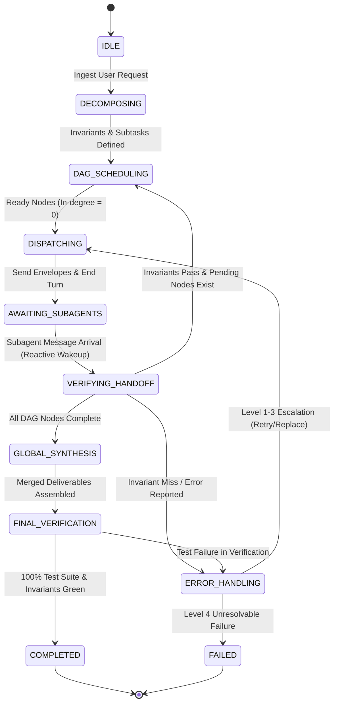

# Hierarchical Decomposition & Delegation Protocol

The **Hierarchical Decomposition & Delegation Protocol** is the primary structural reasoning topology in the Antigravity Multi-Agent Reasoning Framework. It is designed for multi-faceted, complex engineering objectives where monolithic execution is error-prone or context-saturating.

In this workflow, a high-level **Master Orchestrator** ingests user requirements, formulates formal invariants, constructs a Directed Acyclic Graph (DAG) of task dependencies, delegates atomic subtasks to specialized subagents, monitors execution via reactive event-driven wakeups, and synthesizes intermediate outcomes into a cohesive, verified deliverable.

```
                      ┌────────────────────────────────────────┐
                      │          Master Orchestrator           │
                      │  - Formulates Invariants & Builds DAG  │
                      │  - Dispatches & Tracks Dependencies   │
                      └──────────────────┬─────────────────────┘
                                         │
                   ┌─────────────────────┼─────────────────────┐
                   ▼                     ▼                     ▼
          ┌─────────────────┐   ┌─────────────────┐   ┌─────────────────┐
          │ Task 1 (Stage 1)│   │ Task 2 (Stage 1)│   │ Task 3 (Stage 2)│
          │   Researcher    │   │     Planner     │   │   Synthesizer   │
          │ (Codebase Audit)│   │ (Interface Spec)│   │(Implementation) │
          └────────┬────────┘   └────────┬────────┘   └────────┬────────┘
                   │                     │                     │
                   └─────────────────────┼─────────────────────┘
                                         ▼
                      ┌────────────────────────────────────────┐
                      │           Global Synthesis             │
                      │ - Cross-Module Consistency & Merging   │
                      │ - Full E2E Build & Test Verification   │
                      └────────────────────────────────────────┘
```

---

## 1. Subagent Roles & Responsibilities

The hierarchical workflow orchestrates subagents configured in accordance with the [Subagent Registry](../resources/subagents.json) and [Tool Matrix](../references/tool_matrix.md):

| Role Archetype | Primary Responsibilities in Topology | System Prompt Reference | Permitted Capabilities |
|---|---|---|---|
| **Master Orchestrator / Lead Planner** | Invariant definition, MECE decomposition, DAG scheduling, handoff verification, global aggregation | [Planner Prompt](../prompts/planner.md) | `enable_subagent_tools: true`, Read-only |
| **Researcher / Explorer** | Codebase auditing, symbol tracing, dependency mapping, prior art analysis | [Researcher Prompt](../prompts/researcher.md) | `enable_mcp_tools: true`, Read-only |
| **Adversarial Critic** | Interface boundary stress-testing, STRIDE threat modeling, specification review | [Critic Prompt](../prompts/critic.md) | Strict Read-only |
| **Synthesizer / Implementer** | Code generation, patch application, unit test authoring, build execution | [Synthesizer Prompt](../prompts/synthesizer.md) | `enable_write_tools: true`, `run_command` |

---

## 2. Step-by-Step Operational Algorithm

The execution lifecycle proceeds through six strictly ordered phases:

### Phase 1: Ingestion & Invariant Formulation
1. The Orchestrator ingests the user request, architectural boundaries, and environmental constraints.
2. The Orchestrator defines explicit system invariants across four dimensions:
   - **Functional Invariants**: Core behavior, API contracts, input validation rules.
   - **Structural Invariants**: Module boundaries, directory layout, separation of concerns.
   - **Security Invariants**: Least-privilege permissions, input sanitization, safe error handling.
   - **Performance Invariants**: Latency budgets, resource caps, memory bounds.

### Phase 2: MECE Decomposition & DAG Scheduling
1. The Orchestrator decomposes the project into a set of atomic subtasks $T = \{t_1, t_2, \dots, t_n\}$.
2. The Orchestrator constructs a Directed Acyclic Graph $G = (V, E)$ where $V = T$ and directed edge $(t_i, t_j) \in E$ denotes that task $t_j$ depends on the completion and outputs of task $t_i$.
3. The graph is topologically sorted to identify independent tasks (in-degree = 0) eligible for immediate parallel dispatch.

### Phase 3: Specialist Assignment & Task Dispatch
1. For every task $t_k$ with $\text{in-degree}(t_k) = 0$:
   - A specialized subagent is spawned via `invoke_subagent`.
   - A structured dispatch message is transmitted using the [Message Protocols](../references/message_protocols.md) envelope (`**Context**`, `**Content**`, `**Action**`, `**Payload**`).
   - The dispatch specifies the exact input artifact paths, target output path in `.agents/<agent_name>/`, and stage acceptance criteria.
2. The Orchestrator transitions to a **reactive wait state**, calling no further tools and sleeping until awakened by incoming messages.

### Phase 4: Reactive Monitoring & Invariant Verification
1. Subagents execute independently, maintaining liveness by updating `progress.md` with UTC timestamps after each tool step.
2. When a subagent completes its task, it writes a 5-component `handoff.md` to its workspace and sends a completion message to the Orchestrator.
3. The Orchestrator reactively awakens and verifies the subagent's deliverables against the task's acceptance invariants:
   - If verification passes: Task $t_k$ is marked `RESOLVED`. Dependent edges in $G$ are pruned. Downstream tasks that now have in-degree = 0 are immediately dispatched.
   - If verification fails: The Orchestrator invokes the 4-tier error escalation ladder.

### Phase 5: Global Synthesis & Artifact Merging
1. When all nodes in DAG $G$ reach `RESOLVED` status, the Orchestrator initiates the synthesis phase.
2. The Orchestrator reads all intermediate handoffs from `.agents/`, checks cross-module compatibility, and directs the `synthesizer` to perform cohesive patch integration.

### Phase 6: Final Verification & Delivery
1. The project build command and comprehensive test suite are executed.
2. Upon 100% green verification, the Orchestrator compiles the final deliverable and outputs the completion report.

---

## 3. Mermaid State Machine Diagram



---

## 4. State Transition Table

| Current State | Event / Trigger | Invariant / Guard Condition | Next State | Actions & Outputs |
|---|---|---|---|---|
| `IDLE` | User task received | Valid objective framing | `DECOMPOSING` | Parse objective, define functional & structural invariants |
| `DECOMPOSING` | MECE breakdown complete | Subtasks defined without circularity | `DAG_SCHEDULING` | Construct DAG $G=(V,E)$; compute node in-degrees |
| `DAG_SCHEDULING` | Unblocked tasks available | $\exists t_i \in V : \text{in-degree}(t_i) = 0 \land \text{status}(t_i) = \text{READY}$ | `DISPATCHING` | Prepare task brief & payload references |
| `DAG_SCHEDULING` | All tasks resolved | $\forall t \in V : \text{status}(t) = \text{RESOLVED}$ | `GLOBAL_SYNTHESIS` | Read all `.agents/*/handoff.md` deliverables |
| `DISPATCHING` | Subagents invoked | Task briefs sent via `send_message` | `AWAITING_SUBAGENTS` | End turn; enter reactive sleep |
| `AWAITING_SUBAGENTS` | Incoming message arrives | Message contains `handoff_report` | `VERIFYING_HANDOFF` | Parse deliverable artifacts and test results |
| `VERIFYING_HANDOFF` | Invariant checks pass | Deliverables satisfy stage invariants | `DAG_SCHEDULING` | Mark task `RESOLVED`; prune outgoing edges in DAG |
| `VERIFYING_HANDOFF` | Invariant checks fail | Defects or missing deliverables | `ERROR_HANDLING` | Log failure; determine escalation level (1-4) |
| `GLOBAL_SYNTHESIS` | Artifact merge complete | Unified codebase or document generated | `FINAL_VERIFICATION` | Trigger project build and regression tests |
| `FINAL_VERIFICATION` | Verification passed | 100% test assertions green | `COMPLETED` | Compile final handoff report for parent/user |
| `FINAL_VERIFICATION` | Verification failed | Regression or assertion failure | `ERROR_HANDLING` | Assign targeted fix task to `synthesizer` |
| `ERROR_HANDLING` | Escalation resolved | Retry budget or alternative path available | `DISPATCHING` | Re-dispatch task with targeted feedback |
| `ERROR_HANDLING` | Unresolvable deadlock | Constraint conflict or external blocker | `FAILED` | Emit Escalation Dossier to parent/user |

---

## 5. Invariant Verification Gates

At every stage boundary, the Orchestrator enforces strict verification gates before proceeding:

1. **Pre-Dispatch Gate**:
   - Every input artifact referenced in the task brief must exist on disk and be validated.
   - Tool permissions for the assigned subagent must strictly match the archetype security profile.
2. **Post-Handoff Gate**:
   - The worker's `handoff.md` must contain all 5 required sections: Observation, Logic Chain, Caveats, Conclusion, Verification Method.
   - Code deliverables must have zero unaddressed compiler or linter errors.
   - Intermediate test suites must demonstrate passing assertions.
3. **Global Synthesis Gate**:
   - All modules must integrate cleanly without breaking existing interfaces.
   - Full test suite passes end-to-end with zero regressions.

---

## 6. Error Escalation Ladder

When a worker encounters failure or produces non-compliant deliverables, the Orchestrator traverses the 4-tier escalation hierarchy:

```
┌─────────────────────────────────────────────────────────────┐
│ Level 1: In-Place Retry & Targeted Feedback Injection       │
│ - For syntax errors, minor assertion misses, missing links  │
│ - Max retries: 2 per task                                   │
└──────────────────────────────┬──────────────────────────────┘
                               │ (Failure persists)
                               ▼
┌─────────────────────────────────────────────────────────────┐
│ Level 2: Subagent Replacement & Context Reset               │
│ - For hallucinations, context saturation, semantic loops    │
│ - Spawn fresh agent instance with sanitized state snapshot  │
└──────────────────────────────┬──────────────────────────────┘
                               │ (Approach fundamentally flawed)
                               ▼
┌─────────────────────────────────────────────────────────────┐
│ Level 3: Workload Redistribution & Scope Partitioning       │
│ - Decompose complex task into smaller subtasks or shift     │
│   topology (e.g. invoke Debate or Map-Reduce)               │
└──────────────────────────────┬──────────────────────────────┘
                               │ (External blocker / Contradiction)
                               ▼
┌─────────────────────────────────────────────────────────────┐
│ Level 4: Graceful Degradation & Human Escalation            │
│ - Compile complete Escalation Dossier with options & trade-offs│
└─────────────────────────────────────────────────────────────┘
```

---

## 7. Operational Directives & Reactive Execution Rules

1. **Strict Zero-Polling Architecture**:
   - The Orchestrator and subagents operate strictly under Antigravity's event-driven runtime.
   - Agents must **NEVER** run tight polling loops, `sleep` commands, or repeated status checking loops.
   - After invoking subagents or dispatching messages, the Orchestrator simply stops calling tools and awaits reactive wakeups.
2. **Filesystem Scoping & Separation**:
   - All worker metadata, raw logs, and intermediate findings MUST be contained in `.agents/<worker_id>/`.
   - Only the `synthesizer` is authorized to modify source code in the project workspace.
3. **Handoff Compliance**:
   - All completions must provide complete, self-contained 5-component handoff reports.

---

## 8. Related Protocols & References

- **[Subagent Registry Catalog](../resources/subagents.json)**
- **[Inter-Agent Message Protocols](../references/message_protocols.md)**
- **[Subagent Lifecycle Management](../references/agent_lifecycle.md)**
- **[Tool Capability Matrix](../references/tool_matrix.md)**
- **[Planner System Prompt](../prompts/planner.md)**
- **[Synthesizer System Prompt](../prompts/synthesizer.md)**
