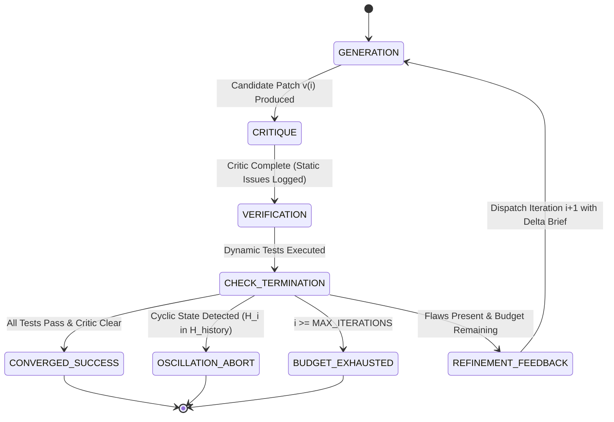

# Iterative Refinement Loop Protocol

The **Iterative Refinement Loop Protocol** is a closed-loop precision control architecture designed for generating, hardening, and verifying complex code implementations, bug patches, and formal specifications.

It couples three specialized subagent roles in a cyclical feedback structure:
- **Generator**: Produces candidate implementations or targeted patches.
- **Critic**: Performs adversarial static code review, probing edge cases, security boundaries, and API contract invariants.
- **Verifier**: Applies candidate patches in an isolated execution environment and executes dynamic test suites, benchmarks, and regression suites.

To guarantee deterministic termination and eliminate infinite loops, the protocol enforces formal **Oscillation Guards**, **Regression Prevention Checks**, and a strict **Bounded Iteration Cap ($\text{MAX\_ITERATIONS} \le 5$)**.

```
                      ┌────────────────────────────────────────┐
                      │          Problem Specification         │
                      │  - Requirements, Constraints & Invars  │
                      └──────────────────┬─────────────────────┘
                                         │
                                         ▼
                      ┌────────────────────────────────────────┐
                 ┌───►│          Generator Subagent            │◄───┐
                 │    │  - Produces Candidate Patch v(i)       │    │
                 │    └──────────────────┬─────────────────────┘    │
                 │                       │                          │
                 │                       ▼                          │
                 │    ┌────────────────────────────────────────┐    │
                 │    │           Adversarial Critic           │    │
                 │    │  - Static Code Inspection & STRIDE     │    │
                 │    │  - Boundary Probing & Flaw Detection   │    │
                 │    └──────────────────┬─────────────────────┘    │
                 │                       │                          │
                 │                       ▼                          │
                 │    ┌────────────────────────────────────────┐    │
                 │    │            Dynamic Verifier            │    │
                 │    │  - Executes Build & Test Suite         │    │
                 │    │  - Evaluates Assertion Pass Rates      │    │
                 │    └──────────────────┬─────────────────────┘    │
                 │                       │                          │
                 │                       ▼                          │
                 │    ┌────────────────────────────────────────┐    │
(Refinement      │    │     Convergence & Termination Gate     │    │ (Iteration
 Delta Feedback) │    │  - All Tests Green & Critic Clear? ───┼─┐  │  Feedback)
                 │    │  - Oscillation Cycle Detected? (H_i)   │ │  │
                 │    │  - Iteration Cap Reached? (i >= MAX)   │ │  │
                 │    └──────────────────┬─────────────────────┘ │  │
                 │                       │                       │  │
                 └───────────────────────┴───────────────────────┘  │
                                                                    │
                                         ┌──────────────────────────┘
                                         ▼
                      ┌────────────────────────────────────────┐
                      │       Verified Final Deliverable       │
                      │  - 100% Invariants & Tests Satisfied   │
                      └────────────────────────────────────────┘
```

---

## 1. Subagent Roles & Responsibilities

The iterative refinement loop assigns subagent roles in accordance with the [Subagent Registry](../resources/subagents.json) and [Tool Matrix](../references/tool_matrix.md):

| Role Archetype | Primary Responsibilities in Loop | System Prompt Reference | Permitted Capabilities |
|---|---|---|---|
| **Generator / Implementer** | Produces initial candidate diff and applies delta refinements across iterations | [Synthesizer Prompt](../prompts/synthesizer.md) | `enable_write_tools: true`, `run_command` |
| **Adversarial Critic** | Performs static code review, evaluates edge cases, audits STRIDE security invariants | [Critic Prompt](../prompts/critic.md) | Strict Read-only |
| **Dynamic Verifier** | Executes build commands, unit tests, integration tests, and performance benchmarks | [Synthesizer Prompt](../prompts/synthesizer.md) | `run_command`, Read-only inspection |
| **Loop Supervisor** | Tracks iteration count $i$, validates convergence, evaluates oscillation and budget guards | [Planner Prompt](../prompts/planner.md) | `enable_subagent_tools: true`, Read-only |

---

## 2. Step-by-Step Operational Algorithm

The Iterative Refinement Loop executes through five discrete phases:

### Phase 1: Initial Candidate Generation (Iteration $i=1$)
1. The Generator receives the problem specification, functional invariants, and interface definitions.
2. The Generator drafts candidate patch $C_1$, writing the implementation and unit test scaffolding to disk.
3. The candidate diff and artifact manifest are published to `.agents/generator/candidate_v1.patch`.

### Phase 2: Adversarial Static Critique
1. The Critic inspects candidate patch $C_i$ against four quality vectors:
   - **Contract & Boundary Invariants**: Nullability, array bounds, type consistency, and edge values.
   - **Concurrency Safety**: Lock ordering, race condition hazards, async context management.
   - **STRIDE Threat Modeling**: Input sanitization, memory safety, privilege escalation risks.
   - **Maintainability & Anti-Patterns**: Unnecessary complexity, dead code, architectural violations.
2. The Critic produces `.agents/critic/critique_v(i).md` with a structured list of actionable defect reports.

### Phase 3: Dynamic Verification & Test Execution
1. The Verifier applies candidate patch $C_i$ in the workspace.
2. The Verifier executes the full automated test suite and regression harness via `run_command`.
3. The Verifier records the test execution matrix:
   - Passing test set: $P_i = \{t \in T \mid \text{result}(t) = \text{PASS}\}$.
   - Failing test set: $F_i = \{t \in T \mid \text{result}(t) = \text{FAIL}\}$.
   - Complete stdout/stderr logs and stack traces saved to `.agents/verifier/test_report_v(i).log`.

### Phase 4: Convergence & Termination Gate
The Loop Supervisor evaluates the candidate against four formal stopping criteria:
1. **Success Convergence**: If Critic reports zero critical issues AND $F_i = \emptyset$ (100% test pass rate) AND all invariants hold, the loop terminates with status `CONVERGED_SUCCESS`.
2. **Oscillation Guard**: Compute semantic content hash $H_i = \text{hash}(C_i)$. If $H_i \in \{H_1, H_2, \dots, H_{i-1}\}$, the loop detects a cyclic oscillation. The loop aborts with status `OSCILLATION_ABORT` to prevent infinite oscillation.
3. **Regression Guard**: Check if $P_{i-1} \not\subseteq P_i$. If previously passing tests now fail, a regression is detected. The Generator is forced to roll back $C_i$ to $C_{i-1}$ and receives explicit regression warnings.
4. **Iteration Budget Exhaustion**: If $i \ge \text{MAX\_ITERATIONS}$ (default 3, hard ceiling 5), the loop terminates with status `BUDGET_EXHAUSTED` and triggers Tier 4 escalation.

### Phase 5: Delta Refinement & Feedback Injection
1. If no termination criteria are triggered: $i \leftarrow i + 1$.
2. The Supervisor compiles a **Targeted Delta Brief** combining:
   - Specific static defects flagged by the Critic.
   - Exact failure logs, line numbers, and stack traces from the Verifier.
   - Regression constraints to protect previously passing test vectors $P_{i-1}$.
3. The brief is dispatched to the Generator via `send_message`, initiating iteration $i+1$.

---

## 3. Stopping Criteria & Loop Invariants

To guarantee bounded execution, the loop enforces four non-negotiable termination invariants:

| Invariant / Guard | Mathematical Formulation | Termination Action |
|---|---|---|
| **Convergence Condition** | $\text{CriticFlaws}(C_i) = 0 \land F_i = \emptyset \land \text{Invariants}(C_i) = \text{TRUE}$ | Exit loop with `CONVERGED_SUCCESS`; deliver final verified patch |
| **Max Iterations Cap** | $i \ge \text{MAX\_ITERATIONS} \quad (\text{default } 3, \text{ ceiling } 5)$ | Exit loop with `BUDGET_EXHAUSTED`; escalate partial work to Tier 4 |
| **Oscillation Guard** | $\exists j < i : \text{hash}(C_i) = \text{hash}(C_j)$ | Exit loop with `OSCILLATION_ABORT`; invoke Arbiter to break deadlock |
| **Regression Prevention** | $\exists t \in P_{i-1} : t \notin P_i$ | Roll back candidate to $C_{i-1}$; re-prompt Generator with regression constraint |

---

## 4. Mermaid State Machine Diagram



---

## 5. State Transition Table

| Current State | Event / Trigger | Invariant / Guard Condition | Next State | Actions & Outputs |
|---|---|---|---|---|
| `GENERATION` | Patch drafted | Patch written to `.agents/generator/` | `CRITIQUE` | Transmit candidate diff to Adversarial Critic |
| `CRITIQUE` | Static review done | Critique report published | `VERIFICATION` | Apply patch and dispatch Verifier test runner |
| `VERIFICATION` | Test run completed | Results logged to `.agents/verifier/` | `CHECK_TERMINATION` | Collect test result sets $P_i$, $F_i$ and compute hash $H_i$ |
| `CHECK_TERMINATION` | Full green | Critic clear $\land F_i = \emptyset$ | `CONVERGED_SUCCESS` | Seal verified code; generate 5-component handoff |
| `CHECK_TERMINATION` | Cycle detected | $H_i \in \{H_1, \dots, H_{i-1}\}$ | `OSCILLATION_ABORT` | Halt loop; escalate to Arbiter with cycle traces |
| `CHECK_TERMINATION` | Budget exhausted | $i \ge \text{MAX\_ITERATIONS}$ | `BUDGET_EXHAUSTED` | Halt loop; produce partial deliverable and error dossier |
| `CHECK_TERMINATION` | Fixable issues | $i < \text{MAX\_ITERATIONS} \land \text{no cycle}$ | `REFINEMENT_FEEDBACK` | Construct delta error brief with logs and static flaws |
| `REFINEMENT_FEEDBACK` | Feedback dispatched | $i \leftarrow i + 1$ | `GENERATION` | Transmit delta brief to Generator for iteration $i+1$ |

---

## 6. Error Escalation & Fallback Handling

When the loop encounters `BUDGET_EXHAUSTED` or `OSCILLATION_ABORT`:

1. **Level 1 Escalation (Oscillation Resolution)**:
   - An independent Arbiter is summoned to analyze candidate $C_i$ vs candidate $C_{i-1}$.
   - The Arbiter injects a missing boundary constraint to force convergence.
2. **Level 2 Escalation (Context Reset)**:
   - If Generator repeatedly fails due to context saturation, a fresh Generator instance is spawned with a sanitized delta brief.
3. **Level 4 Escalation (Human / Parent Escalation)**:
   - If iteration cap is reached without convergence, compile an **Escalation Dossier** containing:
     1. The best-performing candidate patch $C_{\text{best}}$ (highest $|P_k|$).
     2. Residual failing test vectors and error traces.
     3. Specific conflicting invariants preventing full convergence.

---

## 7. Operational Directives & Reactive Execution Rules

1. **Strict Zero-Polling Architecture**:
   - Generator, Critic, and Verifier interact exclusively via event-driven messaging.
   - Agents must **NEVER** run tight polling loops, `sleep` commands, or busy-wait routines.
   - The Supervisor transitions to reactive sleep while each stage executes.
2. **Strict Workspace Scoping**:
   - Critic operates in read-only mode (`enable_write_tools: false`).
   - Only the Generator and Verifier modify or execute files within their designated scopes.

---

## 8. Related Protocols & References

- **[Subagent Registry Catalog](../resources/subagents.json)**
- **[Inter-Agent Message Protocols](../references/message_protocols.md)**
- **[Subagent Lifecycle Management](../references/agent_lifecycle.md)**
- **[Tool Capability Matrix](../references/tool_matrix.md)**
- **[Synthesizer System Prompt](../prompts/synthesizer.md)**
- **[Critic System Prompt](../prompts/critic.md)**
- **[Hierarchical Decomposition Protocol](hierarchical.md)**
