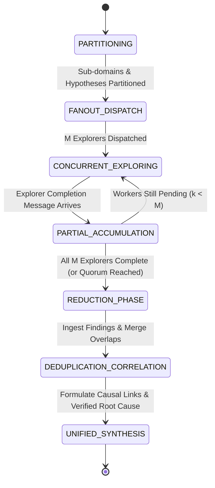

# Map-Reduce / Parallel Exploration Protocol

The **Map-Reduce / Parallel Exploration Protocol** is a high-throughput multi-agent reasoning topology optimized for large search spaces, multi-domain bug hunting, codebase-wide architectural audits, and concurrent hypothesis testing.

In this workflow, a **Coordinator** partitions the investigation domain into orthogonal, non-overlapping search axes, fans out execution to $M$ concurrent **Explorer Subagents** operating in read-only isolation, and triggers a **Reducer** to ingest, deduplicate, correlate, and synthesize the collective findings into a unified, empirically verified deliverable.

```
                      ┌────────────────────────────────────────┐
                      │        Diagnostic Coordinator          │
                      │  - Partitions Hypothesis Search Space  │
                      │  - Defines Orthogonal Investigation    │
                      └──────────────────┬─────────────────────┘
                                         │
                   ┌─────────────────────┼─────────────────────┐
                   │ (Concurrent Fan-Out Dispatch)             │
                   ▼                     ▼                     ▼
          ┌─────────────────┐   ┌─────────────────┐   ┌─────────────────┐
          │   Explorer 1    │   │   Explorer 2    │   │   Explorer M    │
          │  (Concurrency   │   │ (Memory Leaks & │   │(Network & IO    │
          │   & Deadlocks)  │   │  Buffer Pools)  │   │  Serialization) │
          │.agents/expl_1/  │   │.agents/expl_2/  │   │.agents/expl_M/  │
          └────────┬────────┘   └────────┬────────┘   └────────┬────────┘
                   │                     │                     │
                   └─────────────────────┼─────────────────────┘
                                         │ (Asynchronous Wakeup upon Completion)
                                         ▼
                      ┌────────────────────────────────────────┐
                      │           Diagnostic Reducer           │
                      │ - Ingestion & Finding Cataloging       │
                      │ - Deduplication & Cross-Domain Linkage │
                      │ - Causal Correlation & Root Cause Map  │
                      └──────────────────┬─────────────────────┘
                                         │
                                         ▼
                      ┌────────────────────────────────────────┐
                      │       Unified Synthesis Deliverable    │
                      │ - Root Cause Identification & Evidence │
                      │ - Actionable Remediation Roadmap       │
                      └────────────────────────────────────────┘
```

---

## 1. Subagent Roles & Responsibilities

The map-reduce topology orchestrates specialized subagents configured in accordance with the [Subagent Registry](../resources/subagents.json) and [Tool Matrix](../references/tool_matrix.md):

| Role Archetype | Primary Responsibilities in Topology | System Prompt Reference | Permitted Capabilities |
|---|---|---|---|
| **Diagnostic Coordinator** | Hypothesis space partitioning, fan-out dispatching, quorum tracking, lifecycle supervision | [Planner Prompt](../prompts/planner.md) | `enable_subagent_tools: true`, Read-only |
| **Explorer Subagents ($E_1 \dots E_M$)** | Independent deep investigation, symbol searching, empirical evidence gathering with exact line citations | [Researcher Prompt](../prompts/researcher.md) | `enable_mcp_tools: true`, Read-only |
| **Diagnostic Reducer** | Cross-cutting data ingestion, deduplication, causal correlation, global synthesis formulation | [Synthesizer Prompt](../prompts/synthesizer.md) or [Planner Prompt](../prompts/planner.md) | Role-appropriate scoping |

---

## 2. Step-by-Step Operational Algorithm

The Map-Reduce workflow proceeds through five structured phases:

### Phase 1: Hypothesis Space Partitioning (Map Partitioning)
1. The Coordinator evaluates the problem statement, error traces, or audit objectives.
2. The search space is partitioned into $M$ Mutually Exclusive, Collectively Exhaustive (MECE) exploration domains:
   - **Domain 1**: Concurrency, async task scheduling, mutex lock ordering, channel backpressure.
   - **Domain 2**: Memory allocation, buffer retention, object lifecycle, garbage collection pressure.
   - **Domain 3**: Network I/O, socket timeouts, serialization/deserialization, protocol boundaries.
3. Strict boundary constraints and target file patterns are established for each explorer to prevent duplicate scanning.

### Phase 2: Concurrent Fan-Out Dispatch
1. The Coordinator invokes $M$ Explorer Subagents ($E_1, E_2, \dots, E_M$) via `invoke_subagent`.
2. Each explorer receives a structured task dispatch envelope via `send_message` containing:
   - Specific investigation domain and hypothesis to validate.
   - Target files, search queries, and boundary exclusions.
   - Output destination: `.agents/explorer_<id>/findings.md`.
3. The Coordinator enters a **reactive wait state**, calling no further tools while explorers execute concurrently.

### Phase 3: Concurrent Independent Exploration
1. Explorers execute read-only tools (`grep_search`, `find_by_name`, `view_file`, `search_web`).
2. Explorers maintain liveness by updating `progress.md` with UTC timestamps after each tool step.
3. Every finding must be documented with an **empirical evidence chain**:
   - Exact file path and line range (`path/file.py:start-end`).
   - Verbatim code snippet or error trace.
   - Logical reasoning connecting the observation to the domain hypothesis.
4. When exploration completes, the explorer writes `.agents/explorer_<id>/findings.md` and transmits a `handoff_report` envelope to the Coordinator.

### Phase 4: Aggregation, Deduplication & Causal Correlation (Reduce Phase)
1. As explorer handoffs arrive, the Coordinator logs completed tasks in an intermediate registry.
2. Once all $M$ explorers have reported (or quorum is reached with a bounded deadline), the Reducer is activated:
   - **Step 4.1 (Cataloging)**: Ingests all raw observations $O = \bigcup_{k=1}^M O_k$.
   - **Step 4.2 (Deduplication)**: Identifies overlapping code locations and redundant finding reports, merging them into canonical evidence items.
   - **Step 4.3 (Cross-Cutting Causal Correlation)**: Correlates symptoms across disparate domains. For example, connects a database connection pool starvation log discovered by $E_1$ to an unclosed transaction context manager identified by $E_2$.
   - **Step 4.4 (Evidence Weighting & Conflict Resolution)**: Weighs conflicting hypotheses based on empirical depth (e.g. reproduced stack trace vs. static possibility).

### Phase 5: Global Synthesis Deliverable
1. The Reducer compiles a unified findings report:
   - Primary verified root cause (or architectural survey summary).
   - Complete causal dependency graph connecting the initial trigger to observed failures.
   - Prioritized, actionable remediation plan ready for handoff to an [Iterative Refinement Loop](iterative_loop.md) or [Hierarchical Protocol](hierarchical.md).

---

## 3. Mermaid State Machine Diagram



---

## 4. State Transition Table

| Current State | Event / Trigger | Invariant / Guard Condition | Next State | Actions & Outputs |
|---|---|---|---|---|
| `PARTITIONING` | Investigation initiated | Problem scoped into $M$ orthogonal axes | `FANOUT_DISPATCH` | Construct $M$ disjoint task briefs with explicit search scopes |
| `FANOUT_DISPATCH` | All explorers dispatched | $M$ subagent invocations confirmed | `CONCURRENT_EXPLORING` | End turn; enter reactive sleep awaiting worker messages |
| `CONCURRENT_EXPLORING` | Explorer message arrives | Valid `handoff_report` envelope received | `PARTIAL_ACCUMULATION` | Ingest findings into intermediate registry; verify line citations |
| `PARTIAL_ACCUMULATION` | Pending explorers remain | $k < M$ explorers completed | `CONCURRENT_EXPLORING` | Return to reactive sleep |
| `PARTIAL_ACCUMULATION` | All explorers completed | $k = M$ (or timeout with quorum $\ge 80\%$) | `REDUCTION_PHASE` | Ingest all `.agents/explorer_*/findings.md` deliverables |
| `REDUCTION_PHASE` | Raw data loaded | All handoff artifacts accessible | `DEDUPLICATION_CORRELATION` | Eliminate duplicate citations; build cross-domain causal graph |
| `DEDUPLICATION_CORRELATION` | Synthesis completed | Causal chain unbroken; root cause verified | `UNIFIED_SYNTHESIS` | Publish final synthesis report and send completion handoff |

---

## 5. Evidence Chain Schema & Aggregation Contract

Every explorer finding must conform to the standard structured finding format in `findings.md`:

```markdown
### Finding [ID]: [Concise Title]
- **Domain Axis**: [Concurrency | Memory | Network | Storage | Security]
- **Code Citation**: `src/services/session_pool.py:142-158`
- **Verbatim Snippet**:
  ```python
  async with self._lock:
      # Missing timeout handling on nested acquire
      await self._acquire_connection()
  ```
- **Observed Behavior**: Under high load, connection acquisition stalls indefinitely holding the primary lock.
- **Causal Hypothesis**: Root cause of service-wide timeout cascades.
- **Confidence Rating**: [HIGH | MEDIUM | LOW] (Supported by empirical stack trace analysis)
```

---

## 6. Quorum Management & Stranded Explorer Handling

To guarantee that a slow or non-responsive explorer does not block the entire workflow:

1. **Bounded Timeout Watchdogs**:
   - The Coordinator sets a supervisor timer using `schedule(DurationSeconds=600, Prompt="Map-Reduce quorum check", TimerCondition="any")`.
2. **Quorum Threshold**:
   - If $\ge 80\%$ of explorers have reported when the timeout expires, the Coordinator proceeds to `REDUCTION_PHASE` with partial data.
   - Stranded explorers are cleanly cancelled via `manage_task(Action='kill')`.
3. **Escalation Trigger**:
   - If $< 80\%$ of explorers complete within the deadline, Tier 2 escalation is engaged to re-dispatch the missing partitions.

---

## 7. Operational Directives & Reactive Execution Rules

1. **Strict Zero-Polling Architecture**:
   - The Coordinator and explorers rely entirely on event-driven message wakeups.
   - Explorers must **NEVER** run tight polling loops or sleep routines.
   - After fanning out dispatches, the Coordinator ends its turn with zero additional tool calls.
2. **Strict Read-Only Enforcement**:
   - Explorers have `enable_write_tools: false` and must never modify codebase files.
   - All findings are written strictly to `.agents/explorer_<id>/findings.md`.

---

## 8. Related Protocols & References

- **[Subagent Registry Catalog](../resources/subagents.json)**
- **[Inter-Agent Message Protocols](../references/message_protocols.md)**
- **[Subagent Lifecycle Management](../references/agent_lifecycle.md)**
- **[Tool Capability Matrix](../references/tool_matrix.md)**
- **[Researcher System Prompt](../prompts/researcher.md)**
- **[Iterative Refinement Loop Protocol](iterative_loop.md)**
